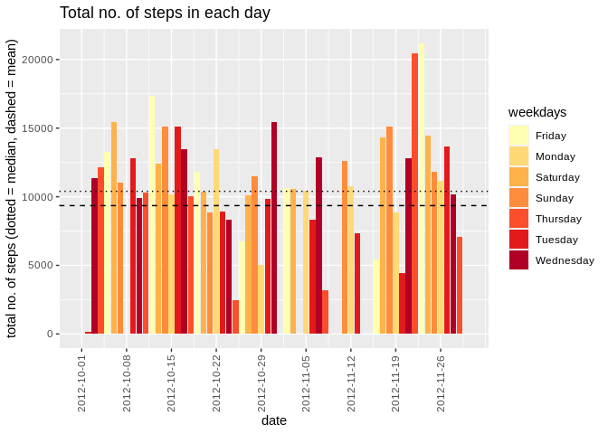
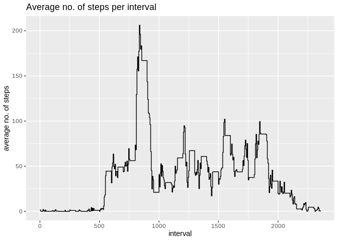
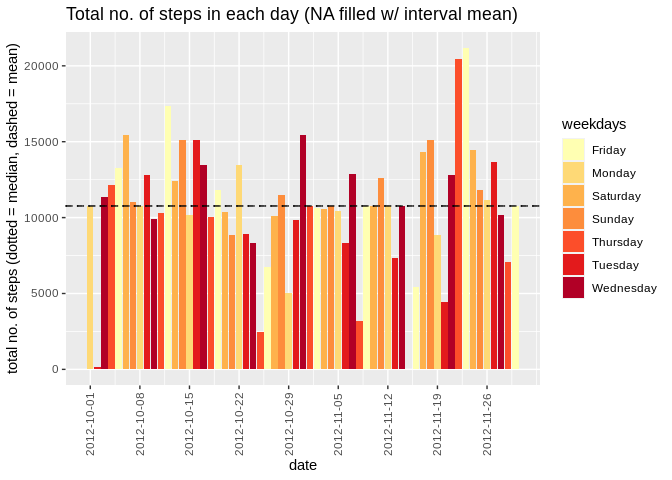
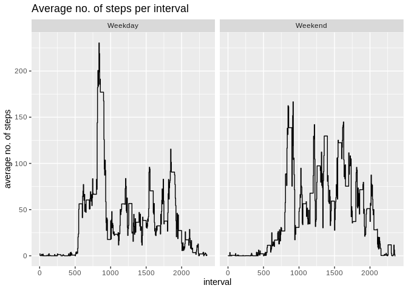

## Loading and preprocessing the data

Before adventuring further in the analysis, we unzip the file containing the
data in order to access it.


```r
file.zip <- file.path(".", "activity.zip")
file.csv <- file.path(".", "activity.csv")
if(file.exists(file.zip) & !file.exists(file.csv)) {unzip(file.zip)}
```

We then read the data using the `read.csv` function:


```r
data <- read.csv(file.csv, header = TRUE, stringsAsFactors = FALSE)
```

The table has dimensions


```r
dim(data)
```

```
## [1] 17568     3
```

and holds the variables


```r
names(data)
```

```
## [1] "steps"    "date"     "interval"
```

representing the no. of **steps** made in a given **date** per time **interval**
(5 minutes span).

We transform the **date** column to become a _Date_ class to better handle its
format later in the analysis:


```r
data$date <- as.Date(data$date, "%Y-%m-%d")
```

Finally we convert the `data.frame` table in a `data.table` format for the sake
of simplicity:


```r
library(data.table)
```

```
## Warning: package 'data.table' was built under R version 3.6.3
```

```r
data <- data.table(data)
```

## What is the mean total number of steps taken per day?

The total number of steps can be computed using the `by` function in the
`DT[i, j, by]` call:


```r
data.steps <- data[,
                   .(steps.sum = sum(steps, na.rm = TRUE), wday = weekdays(date)),
                   by = date
                  ]
```

We can then compute the mean and median of the distributions:


```r
data.steps.median <- median(data.steps$steps.sum)
data.steps.mean   <- mean(data.steps$steps.sum)
print(paste("Median:", data.steps.median))
```

```
## [1] "Median: 10395"
```

```r
print(paste("Mean:", data.steps.mean))
```

```
## [1] "Mean: 9354.22950819672"
```

Finally we can plot the total no. of steps **taken in each day**:


```r
library(ggplot2)
```

```
## Warning: package 'ggplot2' was built under R version 3.6.3
```

```r
plot.steps <- ggplot(data = data.steps, aes(x = date, y = steps.sum, fill = wday)) +
              scale_x_date(breaks = data.steps$date[seq(1, length(data.steps$date), 7)]) +
              theme(axis.text.x = element_text(angle = 90, vjust = 0.5)) +
              scale_fill_brewer(palette = "YlOrRd") +
              geom_bar(stat = "identity") +
              xlab("date") +
              ylab("total no. of steps (dotted = median, dashed = mean)") +
              guides(fill = guide_legend(title = "weekdays")) +
              geom_hline(yintercept = data.steps.median, linetype = "dotted") +
              geom_hline(yintercept = data.steps.mean, linetype = "dashed") +
              scale_linetype_manual(name = "statistics") +
              ggtitle("Total no. of steps in each day")
print(plot.steps)
```

<!-- -->

## What is the average daily activity pattern?

The daily activity pattern is connected to the average no. of steps taken in
each 5-minute interval. We therefore group by that variable to compute the
average no. of steps:


```r
data.avg <- data[, .(steps.avg = mean(steps, na.rm = TRUE)), by = interval]
```

Given the data, we can therefore plot a time series of such variable:


```r
plot.avg <- ggplot(data = data.avg, aes(x = interval, y = steps.avg)) +
            geom_step(direction = "hv") +
            xlab("interval") +
            ylab("average no. of steps") +
            ggtitle("Average no. of steps per interval")

print(plot.avg)
```

<!-- -->

Finally we compute the maximum steps taken in average grouped by intervals:


```r
max.pos <- which.max(data.avg$steps.avg)
max.val <- data.avg[max.pos,]$interval
print(paste("Max no. of steps (", max.val, ") in the ", max.pos, "th time step", sep = ""))
```

```
## [1] "Max no. of steps (835) in the 104th time step"
```

## Imputing missing values

Missing values can be found using the `is.na` function inside the `data.table`
call:


```r
na.steps <- sum(as.numeric(is.na(data$steps)))
na.dates <- sum(as.numeric(is.na(data$date)))
na.intvs <- sum(as.numeric(is.na(data$interval)))
print(paste("Total no. of NA values in: ",
            "step --> ", na.steps, ", ",
            "date --> ", na.dates, ", ",
            "interval --> ", na.intvs, ".",
            sep = ""
           )
     )
```

```
## [1] "Total no. of NA values in: step --> 2304, date --> 0, interval --> 0."
```

```r
print(paste("Total no. of rows with NA values:", dim(data[is.na(data$steps)])[1]))
```

```
## [1] "Total no. of rows with NA values: 2304"
```

We then create a new dataset using the information on the missing values: we
first merge by interval to assign each **step** variable its corresponding
average value, then we substitute **only** the _NA_ values with such
**average**.


```r
data.byinterval <- merge(data, data.avg, by = "interval")
data.byinterval <- data.byinterval[order(date, interval),]
data.byinterval$steps <- as.double(data.byinterval$steps)
data.byinterval <- data.byinterval[is.na(steps), steps := steps.avg]
```

The new dataset looks like


```r
head(data.byinterval)
```

```
##    interval     steps       date steps.avg
## 1:        0 1.7169811 2012-10-01 1.7169811
## 2:        5 0.3396226 2012-10-01 0.3396226
## 3:       10 0.1320755 2012-10-01 0.1320755
## 4:       15 0.1509434 2012-10-01 0.1509434
## 5:       20 0.0754717 2012-10-01 0.0754717
## 6:       25 2.0943396 2012-10-01 2.0943396
```

of dimension

```r
dim(data.byinterval)
```

```
## [1] 17568     4
```

We then recompute the total no. of steps taken each day with filled values


```r
data.steps.fill <- data.byinterval[,
                                   .(steps.sum = sum(steps, na.rm = TRUE),
                                   wday = weekdays(date)
                                   ),
                                  by = date
                                 ]
```

Mean and median have then to be recomputed:


```r
data.steps.fill.median <- median(data.steps.fill$steps.sum)
data.steps.fill.mean   <- mean(data.steps.fill$steps.sum)
print(paste("Median:", data.steps.fill.median))
```

```
## [1] "Median: 10766.1886792453"
```

```r
print(paste("Mean:", data.steps.fill.mean))
```

```
## [1] "Mean: 10766.1886792453"
```

thus showing than **median and mean are now extremely similar**, since we input a
lot of entries taking exactly the mean as value.

Finally the new plot shows possible differences from the previous case:


```r
plot.steps.fill <- ggplot(data = data.steps.fill, aes(x = date, y = steps.sum, fill = wday)) +
                          scale_x_date(breaks = data.steps.fill$date[seq(1, length(data.steps.fill$date), 7)]) +
                          theme(axis.text.x = element_text(angle = 90, vjust = 0.5)) +
                          scale_fill_brewer(palette = "YlOrRd") +
                          geom_bar(stat = "identity") +
                          xlab("date") +
                          ylab("total no. of steps (dotted = median, dashed = mean)") +
                          guides(fill = guide_legend(title = "weekdays")) +
                          geom_hline(yintercept = data.steps.fill.median, linetype = "dotted") +
                          geom_hline(yintercept = data.steps.fill.mean, linetype = "dashed") +
                          scale_linetype_manual(name = "statistics") +
                          ggtitle("Total no. of steps in each day (NA filled w/ interval mean)")
print(plot.steps.fill)
```

<!-- -->


## Are there differences in activity patterns between weekdays and weekends?

In order to study differences coming from weekdays and weekends, we first add
a **factor** variable to distinguish Mondays through Fridays and Saturdays to
Sundays.


```r
day.factor <- format(data.byinterval$date, "%u")
day.factor[day.factor %in% 1:5] <- "Weekday"
day.factor[day.factor %in% 6:7] <- "Weekend"
day.factor <- factor(day.factor, levels = c("Weekday", "Weekend"))
data.byinterval$day <- day.factor
```

We then group the data by interval and type of day to compute possible
differences:


```r
data.byday <- data.byinterval[,
                              .(steps.avg = mean(steps, na.rm = TRUE)),
                              by = list(interval, day)
                             ]
```

Finally we plot the data divided into _weekday_ and _weekend_ side-by-side:


```r
plot.avg.byday <- ggplot(data = data.byday, aes(x = interval, y = steps.avg)) +
                  geom_step(direction = "hv") +
                  facet_grid(. ~ day) + 
                  xlab("interval") +
                  ylab("average no. of steps") +
                  ggtitle("Average no. of steps per interval")

print(plot.avg.byday)
```

<!-- -->

It seems that during **weekends** the no. of steps drops in the maximum absolute
peak but it gets more substantially consistent throughout the day.
